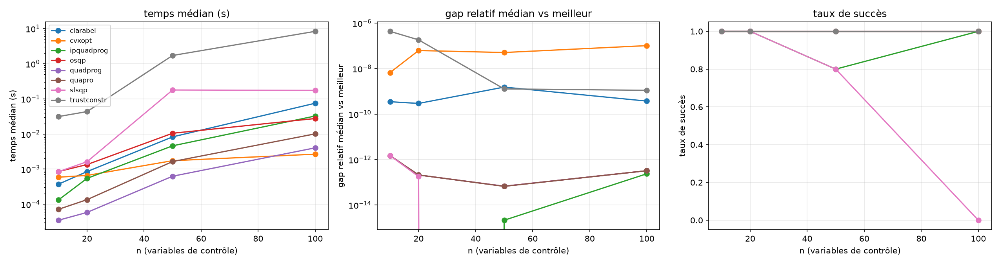

# QP Bench — comparateur de solveurs de programmation quadratique

Projet **séparé** d'[IPQuadProg](https://github.com/cd2238/IPQuadProg) : un
code Python orienté objet qui compare le solveur Fortran "maison" (points
intérieurs primal-dual, Mehrotra) avec des solveurs QP accessibles
publiquement, sur des **problèmes convexes denses de taille croissante**
(n = 10 → 100) avec **plusieurs contraintes d'inégalité** (m = ratio × n).

Formulation canonique — celle d'IPQuadProg :

```
min  1/2 x'Gx + c'x
s.c.  A x >= b          G symétrique définie positive
```




## Solveurs comparés

| Nom | Bibliothèque | Famille d'algorithmes | Convention native → conversion |
|---|---|---|---|
| `ipquadprog` | [IPQuadProg](https://github.com/cd2238/IPQuadProg) (Fortran) | points intérieurs primal-dual (Mehrotra) | `Ax ≥ b` → aucune |
| `quadprog` | [quadprog](https://github.com/quadprog/quadprog) (pip) | dual ensemble actif (Goldfarb-Idnani) | `min ½x'Gx − a'x`, `Cᵀx ≥ b` → `a = −c`, `C = Aᵀ` |
| `cvxopt` | [CVXOPT](https://cvxopt.org/) | points intérieurs | `Gx ≤ h` → `G = −A`, `h = −b` |
| `osqp` | [OSQP](https://osqp.org/) | ADMM (1er ordre) | `l ≤ Mx ≤ u` → `l = b`, `u = +∞` |
| `clarabel` | [Clarabel](https://clarabel.org/) | points intérieurs coniques | `Mx + s = b`, `s ≥ 0` → `M = −A` |
| `slsqp` | SciPy | SQP | `f(x) ≥ 0` → `f = Ax − b` |
| `trustconstr` | SciPy | régions de confiance | `lb ≤ Ax ≤ ub` → `lb = b`, `ub = +∞` |
| `quapro` | Casa-Pola | Activation de contraintes | `min ½x'Qx − p'x`, `Cx ≥ b` → `p = −c` |


## Structure du projet

| Fichier | Rôle |
|---|---|
| `qpbench.py` | cœur objet : `QPProblem` (+ générateur), `SolverResult`, `QPSolver` (ABC), les 8 adaptateurs, métriques KKT |
| `build_ipquadprog.py` | clone/compile IPQuadProg en `libipquadprog.so` (ctypes) |
| `run_bench.py` | `BenchConfig`, `BenchmarkRunner`, synthèses CSV, figures, auto-test |
| `results/` | sorties (`results.csv`, `summary.csv`, `benchmark.png`) |

## Installation (Ubuntu/Debian)

```bash
sudo apt install gfortran liblapack-dev libblas-dev git
uv init
uv add numpy scipy pandas matplotlib quadprog cvxopt osqp clarabel
```


## 1. Compiler IPQuadProg

```bash
uv run build_ipquadprog.py                # clone le dépôt, compile en .so
```

Désactiver quapro si besoin (code à trouver sur le web...)


## 2. Valider les conventions (tous les solveurs doivent donner les mêmes résultats)

```bash
uv run run_bench.py --check
```

Résout un même petit problème avec tous les solveurs disponibles et
vérifie que les objectifs coïncident (écart attendu < 1e-8). Si un
solveur diverge, c'est presque toujours un problème de convention — la
table ci-dessus sert de checklist.

## 3. Lancer le benchmark

```bash
python run_bench.py --sizes 10,20,50,100 --m-ratio 2 --seeds 5 --cond 10
python run_bench.py --sizes 50 --solvers ipquadprog,quadprog,osqp   # sous-ensemble
```

### Sorties

- `results/results.csv` — une ligne par (problème × solveur) : `time_s`,
  `iterations`, `status`, `objective`, `primal_violation`,
  `dual_residual`, `complementarity`, `gap` (vs meilleur objectif valide
  du problème), `success`.
- `results/summary.csv` + affichage console — par (solveur × taille) :
  temps médian, gap médian, taux de succès, itérations médianes.
- `results/benchmark.png` — trois figures : temps vs n, gap vs n, taux
  de succès vs n.
- graphique 

## Méthodologie

- **Mêmes problèmes pour tous** : génération déterministe par
  `seed = 1000·n + seed` ; `G` à spectre imposé (`--cond`), contraintes
  garanties faisables via un point de référence intérieur, une fraction
  rendue (quasi) active pour solliciter l'ensemble actif.
- **Warm-up** avant chronométrage (imports, caches) ; désactivable par
  `--no-warmup`.
- **Métriques KKT recalculées en Python** pour tous (violation primale,
  résidu dual avec duals estimés par moindres carrés sur les contraintes
  actives, complémentarité) : aucune confiance aveugle dans ce que
  déclare chaque solveur.
- **Réglages** : OSQP est resseré à `eps 1e-9` + polissage (sinon l'ADMM
  est artificiellement pénalisé) ; SLSQP à `ftol 1e-12`. IPQuadProg
  utilise `itermax = 1000`, `mutol = 1e-10` (cf. `IPQuadProgSolver`).
- **Scilab** : chaque appel paie le démarrage du binaire (1–5 s) ;
  comparer sa colonne `time_s` avec prudence, ou l'exclure des figures.

## Pistes d'extension

- Contraintes d'égalité (`me > 0` côté quadprog/qp_solve, `Aeq` côté
  CVXOPT) — IPQuadProg ne les gère pas encore.
- Étude du conditionnement (`--cond 10..1e6`).
- Problèmes creux et grandes tailles : IPQuadProg est dense (à n = 100
  c'est indolent, à n = 1000 OSQP/Clarabel prennent le dessus).
- Géométrie des contraintes : jouer sur `tight_frac` (contraintes
  actives à l'optimum) pour opposer ensemble actif et points intérieurs.
